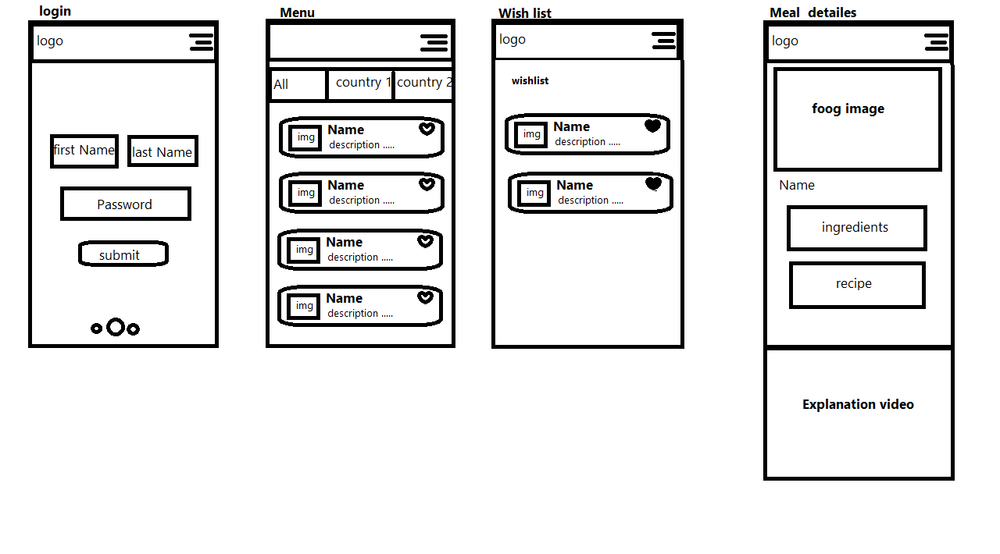

# Word of food 
Our app is a kitchen guide for everyone who wants to learn cooking techniques,Includes food from different regions, details of the ingredients of each recipe, and an explanatory video.

## Links
* [Design](https://www.figma.com/file/sx5orKLY8z4JLpZyaeLnZc/Untitled?node-id=0%3A1)
* Live Link [Here](https://gsg-cf05.github.io/World-of-food-app--team9/)
## Problem
People who travel a lot face many problems in choosing food according to the country they are traveling to, and they also face problems in the way of preparing these meals
There are many people who are allergic to some types of food, for this reason when they eat a meal outside the house, it is very important to know the components of this meal.

## Solution
Food World is an application that provides a menu of meals and you can classify meals according to the name of the country.
When you choose a specific meal, it will show you the ingredients of that meal with the method of preparation and an explanatory video of the method of preparation.

## The wireframe

## User Journey
First, when you open the application login page, you can register with your email
When you log in, a list of meals with icons sorted by country name will appear at the top of the page. You can choose the name of a specific country to show its famous dishes
On each meal there is a heart symbol. When you click on it, the meal goes to the wish list
When you click on any meal, it will take you to the meal details page, which contains a description of the ingredients for that meal, the method of preparation with an explanatory video.

## User Stories
* As a user I can land on the first page and click on Regester now button to sign in.
* As a user I can sign in with my email.
* As a user I can choosind the country to show its traditional meals.
* As a user I can see list of recipe and choose what I liked of them.
* As a user I can see the recipe image, name, region, ingredients, and instructions.
* As a user I can add any recipe to my favorite list.

## How To clone Our App:
* Open gitBash wherever you want to save the project on your device.
* Clone the repository to your device (`git clone repo link`).
* Enter repo `cd nameOfRepo`
* Type -> `code .`
* Navigate to the live server from the HTML file.

## Technologies:
* HTML
* CSS
* javascript
* local storage
* API
## Team members:
* [Jomana Al-zayagh](https://github.com/Jomanahani)
* [Said madi](https://github.com/Saeed99Madi)
* [Seef hayek](https://github.com/SaifHayek)
* [Ahmed abutaha](https://github.com/Ahmed-jebara)
## Resources
API documentation:
* API (1): [Aria Api](www.themealdb.com/api/json/v1/1/filter.php?a=Canadian)
* API (2): [Food Api](https://www.themealdb.com/api.php)
